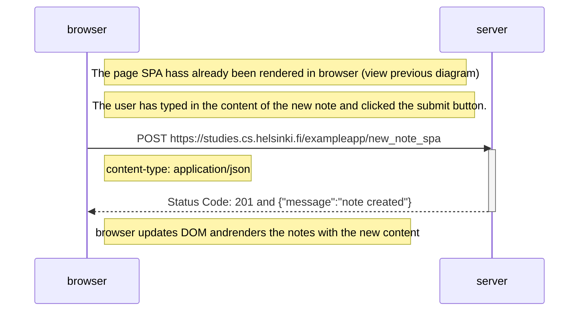

```mermaid
sequenceDiagram
  participant browser
  participant server

  Note right of browser: The page SPA hass already been rendered in browser (view previous diagram)
  Note right of browser: The user has typed in the content of the new note and clicked the submit button.

  browser->>server: POST https://studies.cs.helsinki.fi/exampleapp/new_note_spa
  activate server
  Note right of browser: content-type: application/json
  server-->>browser: Status Code: 201 and {"message":"note created"}
  deactivate server

  Note right of browser: browser updates DOM andrenders the notes with the new content
```
